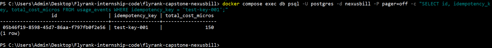
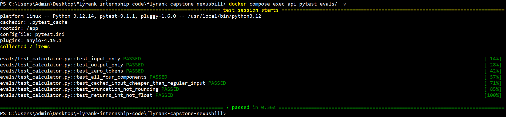
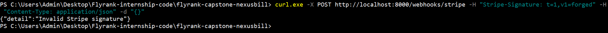

# EVIDENCE.md

Proof for each of NexusBill's five correctness guarantees, using real
output captured during development — not staged demonstrations.

---

## Guarantee 1: No double-counting

**Claim:** The same request with the same idempotency key produces
exactly one usage event, even when retried.

**Proof method:** Sent an identical request twice with
`Idempotency-Key: test-key-001`, then queried `usage_events` directly.

**Result:**

First call → {"id":"05b46f19-...", "usage":{...}, "total_cost_micros":150, "idempotent_replay":false}
Second call → {"id":"05b46f19-...", "usage":{...}, "total_cost_micros":150, "idempotent_replay":true}

SELECT id, idempotency_key, total_cost_micros FROM usage_events WHERE idempotency_key = 'test-key-001';
→ exactly 1 row, unchanged after every later query in this project

**Why it holds:** `idempotency_key` carries a `UNIQUE` constraint at the
database level (`migrations/0001_initial_schema.sql`). The application
checks for an existing row first and returns the stored result — but even
if two identical requests raced past that check simultaneously, only one
`INSERT` could succeed; the second would fail on the constraint, not
silently duplicate. The guarantee is enforced by Postgres, not by
application logic that could have a race condition.

---

## Guarantee 2: Exact quota boundaries

**Claim:** A request that would push usage over the plan limit is
rejected before any usage is recorded, at an exact boundary.

**Proof method:** Seeded a Pro-tier org's current-period usage to
exactly 4,999,990 of its 5,000,000-token quota — 10 tokens of headroom.
Sent one real request through the live endpoint.

**Result:**

{"detail":{"error":"token_quota_exceeded",
"message":"Token quota exceeded for this billing period.",
"quota":5000000,"used":4999990,"this_request":296,"usage_type":"tokens"}}

**Why it holds:** `check_quota()` (`app/core/billing/quota.py`) computes
real current-period usage via an aggregate query, then applies strict
integer inequality — `(existing_tokens + this_request_tokens) > quota`
— before any `INSERT` happens. With only 10 tokens of margin between
"allowed" and "rejected," there is no rounding, no percentage
approximation, and no window where a rejected request's tokens are
partially recorded: the check runs, and only on success does an event
get written at all.

---

## Guarantee 3: Immutable cost history

**Claim:** Token costs are computed and stored at write time using
pricing pinned at that moment. Historical costs are never recalculated.

**Proof method:** `CostCalculator` unit tests (7/7 passing,
`evals/test_calculator.py`), cross-checked by hand against a real
request's actual output.

**Result:**

7 passed in 0.36s

Real request: nexus-1-mini, 7 input tokens, 249 output tokens
Hand check: (7 × 150,000 + 249 × 600,000) ÷ 1,000,000 = 150.45 → 150
Actual stored value: total_cost_micros = 150 ✓ exact match

**Why it holds:** `usage_events.total_cost_micros` stores the computed
cost directly on the row at insert time — it is never derived by
joining to `models` at read time. If `models.input_price_per_1m_micros`
changes tomorrow, every already-written `usage_events` row is
untouched; only new events use the new price. Integer arithmetic
throughout (no floats) means the same inputs always produce the same
output, with no platform- or time-dependent rounding drift.

---

## Guarantee 4: Webhook integrity

**Claim:** Every incoming Stripe webhook is signature-verified before
processing. Duplicates are detected and ignored. Failed events are
retained in a dead letter queue, never silently dropped.

**Proof method:** Three separate tests — a forged signature, a resent
already-processed event, and a genuinely failing event retried past its
retry ceiling.

**Result:**

curl -H "Stripe-Signature: t=1,v1=forged" ... → 400 {"detail":"Invalid Stripe signature"}
Zero rows written to stripe_webhook_events for the forged request.

Event evt_1UEZJo2VaZ2qCybxuhhWxle0:
event_type: customer.subscription.updated
status: failed
attempts: 4
last_error: "No local subscription found for Stripe subscription ..."

Row retained, queryable via GET /admin/failed-webhooks — never deleted.
Also verified: resending an already-processed event (checkout.session.completed)
left its attempts counter unchanged at 1 — not reprocessed, not double-applied.

**Why it holds:** `stripe.Webhook.construct_event()` verifies the raw
request body's signature against `STRIPE_WEBHOOK_SECRET` before a
single byte is written to the database — an invalid signature means
zero rows touched. A `stripe_event_id` UNIQUE constraint plus an
explicit `status == "processed"` check (not just "a row exists")
prevents reprocessing genuine duplicates while still allowing a
previously-*failed* event to be retried. Failures increment `attempts`
and flip to `status: "failed"` at a fixed ceiling (3) — the row is
never deleted, making it a real dead letter queue, recoverable via
`POST /admin/failed-webhooks/:id/retry`. (This particular event's
`attempts: 4` reflects one additional retry attempted via that admin
endpoint against synthetic test data with no matching local
subscription — the retry correctly failed for a real reason rather
than silently "succeeding," proof the retry path enforces the same
validation as live processing.)

---

## Guarantee 5: Tenant isolation

**Claim:** Every query touching org data is scoped by `org_id`.
Cross-tenant access is structurally impossible, not UI-gated.

**Proof method:** Created a project under Org A (`Acme Corp`).
Registered a completely separate Org B. Attempted to fetch Org A's
project using Org B's own valid JWT.

**Result:**

Org A's project: de7be0d4-4a46-4523-8ba0-b73cb828e5f6 (org_id: 69de432a-...)

GET /projects/de7be0d4-4a46-4523-8ba0-b73cb828e5f6
Authorization: Bearer <Org B's own valid token>

→ {"detail":"Project not found"} (404, not the project's data)

**Why it holds:** `get_owned_project()` (`app/core/deps.py`) derives the
caller's org entirely from their JWT's `sub` claim — never from a
client-supplied ID — then checks `project.org_id != org.id` before
returning anything, collapsing "doesn't exist" and "belongs to someone
else" into the same 404. This dependency is shared across every
project- and key-scoped route, so the guarantee holds structurally: a
route can't forget to check, because the check is the only way to get
the object at all. There is no ID a client could supply that bypasses
this — ownership isn't verified after the fact, it's a precondition of
the lookup itself.
