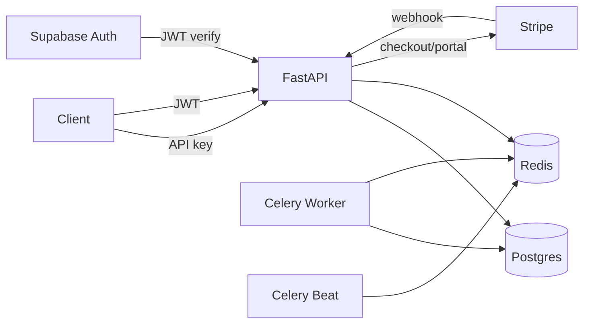

# NexusBill

Usage-based billing infrastructure for an AI API product. It meters every
billable request, enforces quota limits before they're exceeded, computes
exact per-request cost, and keeps subscription state in sync with Stripe —
the layer a company selling AI API access needs between "someone called
our API" and "we billed them correctly for it."

Built as a solo capstone project. No real AI model is called — completions
are simulated — but every part of the billing, metering, and payment
pipeline around that simulated call is real and independently proven (see
[EVIDENCE.md](EVIDENCE.md)).

---

## The five correctness guarantees

1. **No double-counting** — the same request retried never gets billed twice.
2. **Exact quota boundaries** — a request that would exceed a plan's limit is rejected before anything is recorded, not approximately.
3. **Immutable cost history** — a price change today never rewrites yesterday's bill.
4. **Webhook integrity** — every Stripe event is signature-verified, deduplicated, and never silently dropped if it fails.
5. **Tenant isolation** — one customer can never see or touch another's data, by construction, not by convention.

Each one is proven with real, captured output in [EVIDENCE.md](EVIDENCE.md).

---

## Architecture



Five containers, one `docker compose up`: **Postgres** (source of truth),
**Redis** (message broker), the **API** itself, a **Celery worker**
(executes background jobs), and **Celery beat** (schedules them — nightly
usage rollups at 1am, nightly Stripe reconciliation at 2am).

**Path 1 — a billable API call.** A client sends `POST
/v1/chat/completions` with an API key. The key is hashed and looked up;
the org's status and quota are checked; if there's room, a mock response
is generated, its cost computed from pinned model pricing, and one row is
written to `usage_events` — guarded by a database-level uniqueness
constraint so a retried request can never create a second row.

**Path 2 — a Stripe webhook arrives.** Every incoming webhook is
signature-verified before a single byte is written anywhere. It's
recorded, then routed by event type — a completed checkout upgrades the
org's plan, a cancelled subscription downgrades it to Free. If handling
fails, the event is retried up to three times before being marked as a
dead letter — retained, never dropped, recoverable through an admin
endpoint.

**Path 3 — nightly background jobs.** Celery beat triggers two jobs each
night: one aggregates the day's usage into a fast-to-read rollup per
organization, the other compares every org's local subscription record
against Stripe's own view of it and flags any drift.

---

## Tech stack

| Layer | Choice |
|---|---|
| API framework | FastAPI (Python) |
| Database | PostgreSQL, via SQLModel |
| Auth | Supabase Auth (JWT, JWKS-verified) |
| Background jobs | Celery + Redis |
| Payments | Stripe (Checkout, webhooks, customer portal) |
| Containerization | Docker Compose, 5 coordinated services |

**Concepts implemented (5+ required):** API endpoints, database,
authentication, background jobs, caching (usage rollup). Two swaps from
the original concept list: **LLM integration** was swapped for a token
pricing/cost-calculation model — the billing infrastructure was the
actual subject of this capstone, not model output quality, so metering a
simulated response proves the same thing a real one would. **A single
service** was swapped for the **full 5-service Docker Compose stack** —
demonstrating the real production topology (API, worker, beat, Redis,
Postgres coordinating together) rather than one process in isolation.

---

## Running locally

```bash
docker compose up -d --build
docker compose exec api python scripts/run_migrations.py
docker compose exec api python scripts/seed.py
```

That's it. `GET http://localhost:8000/health` should return `{"status":
"ok"}`. Full interactive API docs at `http://localhost:8000/docs`.

Stripe features (checkout, webhooks) additionally need a `.env` filled in
from `.env.example` with real test-mode Stripe keys, and `stripe listen
--forward-to localhost:8000/webhooks/stripe` running locally to receive
webhook events — see `.env.example` for exactly which variables.

---

## Seeded data

Three plans (`free`, `pro`, `enterprise`) and three models (`nexus-1`,
`nexus-1-mini`, `nexus-2`) with real per-token pricing are seeded
automatically, along with a ready-to-use **Demo Org**, **Demo Project**,
and one active API key — printed once to the console during
`scripts/seed.py`. Copy it from your terminal output and call
`/v1/chat/completions` immediately, no registration required. (Want your
own account instead? `POST /auth/register` works the same way it always
has, and gets you a fresh org on the Free plan.)

---

## API reference

| Method | Path | Auth |
|---|---|---|
| GET | `/health` | none |
| POST | `/auth/register` | none |
| POST | `/auth/login` | none |
| GET | `/auth/me` | JWT |
| GET | `/org` | JWT |
| POST/GET | `/projects` | JWT |
| GET/PATCH/DELETE | `/projects/{id}` | JWT |
| POST/GET | `/projects/{id}/keys` | JWT |
| DELETE | `/projects/{id}/keys/{key_id}` | JWT |
| GET | `/v1/whoami` | API key |
| POST | `/v1/chat/completions` | API key |
| GET | `/org/usage` | JWT |
| POST | `/billing/estimate` | JWT |
| POST | `/billing/checkout` | JWT |
| POST | `/webhooks/stripe` | Stripe signature |
| POST | `/admin/reconcile` | JWT* |
| GET | `/admin/reconciliation-reports` | JWT* |
| GET | `/admin/failed-webhooks` | JWT* |
| POST | `/admin/failed-webhooks/{id}/retry` | JWT* |

*`/admin/*` routes require login but are not org-scoped — see
Limitations below.

---

## The cost model

Pricing is stored in microdollars (millionths of a dollar) per million
tokens — integers throughout, never floats, so nothing ever rounds
unpredictably. A real worked example, straight from `POST
/billing/estimate`:

**Input:** `nexus-1`, 1,000 requests/day, 500 avg input tokens, 200 avg
cached-input tokens, 300 avg output tokens, 50 avg reasoning tokens, 30
days.

**Output:**
```json
{
  "estimated_requests": 30000,
  "estimated_tokens": {"input": 15000000, "cached_input": 6000000, "output": 9000000, "reasoning": 1500000},
  "cost_breakdown": {
    "input_cost": "$45.00", "cached_input_cost": "$1.80",
    "output_cost": "$135.00", "reasoning_cost": "$22.50", "total": "$204.30"
  },
  "plan_recommendation": {"current_plan": "free", "recommended_plan": "enterprise", "reason": "Estimated token usage exceeds Free tier quota by 315x"}
}
```

Cached input tokens price at a tenth of regular input — the same
distinction real AI providers make, and one the calculator handles as a
first-class case, not a special-cased hack.

---

## Proof: EVIDENCE.md

[EVIDENCE.md](EVIDENCE.md) proves all five correctness guarantees above
with real, captured command output and screenshots — not claims.

---

## What I'd build next

- **Wire quota enforcement to the rollup cache.** `GET /org/usage` reads
  from the fast rollup table built in M3; the actual quota *enforcement*
  on the live billable path still queries `usage_events` directly, the
  same shortcut M3 was supposed to replace. Correct, but not the
  scalable version — this is the single most important item on this
  list.
- **A real platform-admin role**, separate from customer JWTs, so
  `/admin/*` routes are genuinely access-controlled rather than open to
  any authenticated org owner.
- **Enforce `rate_limit_rpm`.** It's seeded per plan but never actually
  checked anywhere in the request path.
- **An outbox/reconciliation sweep** for the rare case where a
  registration's compensating rollback itself fails mid-crash — the
  in-request rollback handles the common case; a background sweep would
  close the remaining gap.
- **Proration** on plan upgrades/downgrades mid-billing-period.
- **A real integration test suite** beyond `CostCalculator`'s unit
  tests — end-to-end tests exercising the full metering and webhook
  paths automatically, not just via manual `curl`/Stripe CLI sessions.

---

## Limitations (honest)

- **No real AI model is called.** `/v1/chat/completions` simulates a
  response — token counts are semi-realistic (input derived from actual
  message length, output randomized within a plausible range) but no
  actual model inference happens.
- **Quota enforcement queries live events, not the rollup cache** — see
  above. Correct, not yet optimized.
- **`/admin/*` routes are not tenant-scoped** — any authenticated user
  can see every org's reconciliation reports and failed webhooks. A real
  production system needs a distinct staff/admin identity.
- **`rate_limit_rpm` is seeded but unenforced.**
- **No proration** on mid-period plan changes.
- **Registration's rollback covers the common failure case** (Supabase
  signup succeeds, local org creation fails) but not a process crash
  between those two steps — a rare window, not fully closed.